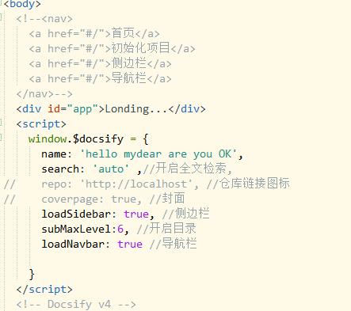
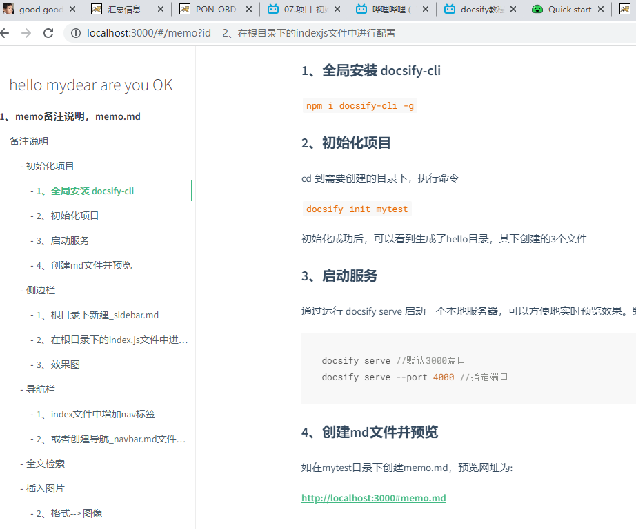
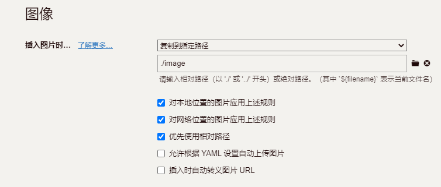
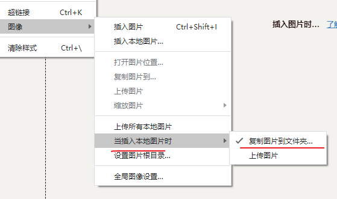

---


---

### 初始化项目

####	1、全局安装 docsify-cli 

<code>npm i docsify-cli -g</code>

#### 	2、初始化项目

cd 到需要创建的目录下，执行命令

```docsify init mytest```

初始化成功后，可以看到生成了hello目录，其下创建的3个文件 

#### 3、启动服务

通过运行 docsify serve 启动一个本地服务器，可以方便地实时预览效果。默认访问地址 http://localhost:3000

```js
docsify serve //默认3000端口
docsify serve --port 4000 //指定端口
```

#### 4、创建md文件并预览

如在mytest目录下创建memo.md，预览网址为:

http://localhost:3000#memo.md

### 侧边栏

#### 1、根目录下新建_sidebar.md

添加侧边栏的导航链接

```
* 1、memo备注说明，memo.md
	* [备注说明](/memo.md)
	
* 2、hello my dear
  * [hello,Docsify](/mymd01.md) <!--注意这里是相对路径-->

* 3、are you ok
  * [are you ok,Docsify](/mymd02.md)
```

#### 2、在根目录下的index.js文件中进行配置



#### 3、效果图



### 导航栏

可以用 HTML 创建一个导航栏。  注意：文档的链接都要以 #/ 开头

#### 1、index文件中增加nav标签

```js
<nav>
		<a href="#/">首页</a>
		<a href="#/">初始化项目</a>
		<a href="#/">侧边栏</a>
		<a href="#/">导航栏</a>
	</nav>
```

#### 2、或者创建导航_navbar.md文件，并在其中编写目录

​		修改index.html中的配置,增加loadNavbar: true, //导航栏

```
* 首页
* 初始化项目
* 侧边栏
* 导航栏
* 选项
   * [章鱼哥](/link)
   * [胖大星](/link)
   * [蟹黄堡](/link)
   * [海绵宝宝](/link)
```

### 全文检索

search: 'auto' //开启全文检索


### 插入图片

1、文件-->偏好设置--> 图像

选择复制到指定路径，然后在下面一栏中填写`./image`, 然后下面的三项全打勾

网络图片也会自动存储到与文件同级的image文件夹下



#### 2、格式--> 图像

当插入本地图片时，复制到文件夹中




### 插入视频及pdf

#### 1、插入视频

```js
<video width='480' height='400' controls>
    <source srv='./info/dingdang.mp4' type='video/mp4'>
</video>
```
<!---<video width='480' height='400' controls>
    <source src='./info/dingdang.mp4' type='video/mp4'>
</video>-->


#### 2、插入视频2

```js
<iframe width=480 height=400 src='./info/dingdang.mp4'>
```


#### 3、插入pdf并打开
```html
<iframe src='./info/dingdang.pdf#page=1' width='100%' height='500px'>
```

<!---<iframe src='./info/dingdang.pdf#page=1' width='100%' height='500px'> -->


### 本页内/其他页跳转

#### 1、本页面内跳转 

h1-h6, #id的值即为标题本身的文字

` [描述文字](#id),如: [全文检索](#全文检索)`

[全文检索](#全文检索)

#### 2、跳转到其他页面的特定ID处

`[跳转至mymd01->文件机构](mymd01.md#文件结构)`

[跳转至mymd01->文件机构](mymd01.md#文件结构)

### Typora用法

网上的一个教程： * [最齐全的Typora使用教程](https://blog.csdn.net/qq_41261251/article/details/102817673?utm_medium=distribute.pc_relevant_t0.none-task-blog-2~default~BlogCommendFromMachineLearnPai2~default-1.control&dist_request_id=&depth_1-utm_source=distribute.pc_relevant_t0.none-task-blog-2~default~BlogCommendFromMachineLearnPai2~default-1.control)

asdfsa

#### fas

dfa

sf

a

sdf